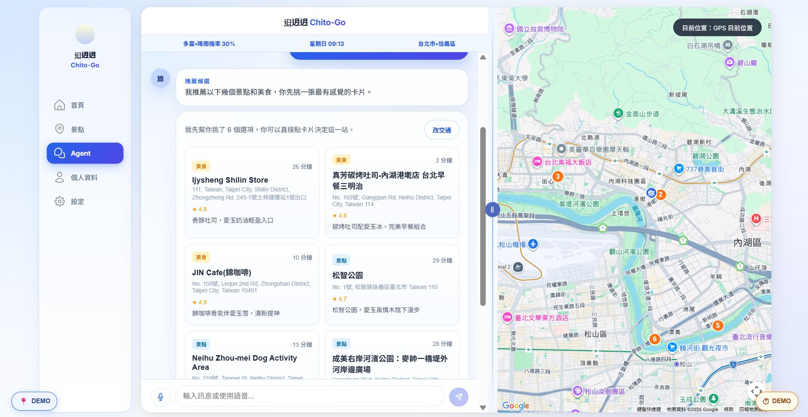
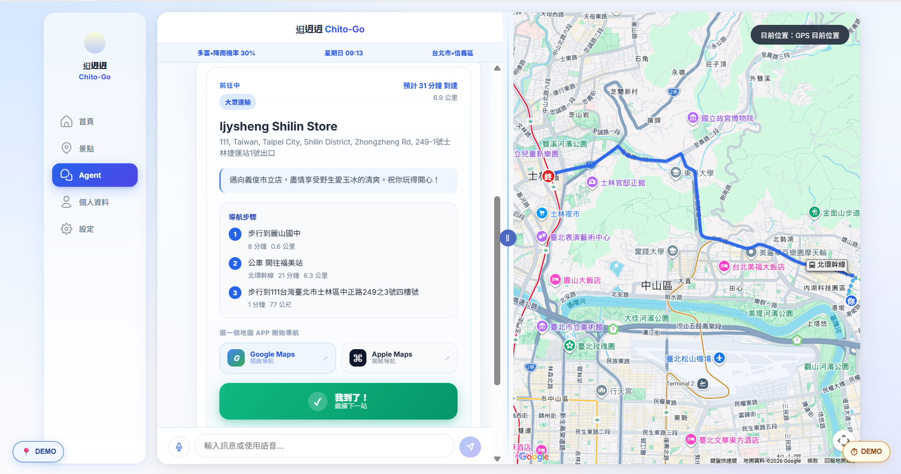
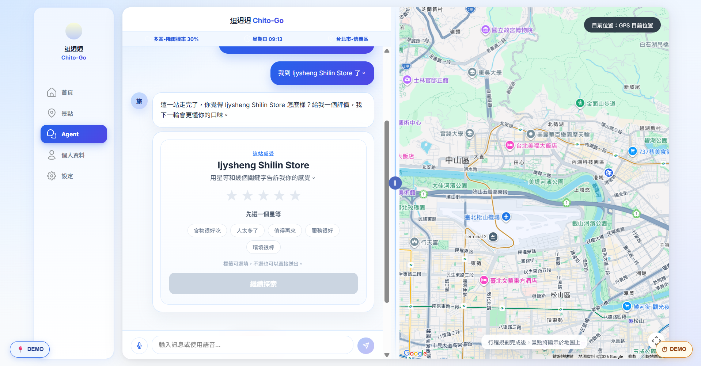

# 𨑨迌迌 Chito-Go

**賽題分類**：賽題 A · ⾏旅台北

**團隊**：第 19 隊「Kawairoha」

<p align="center">
  
</p>
<p align="center">
  
</p>
<p align="center">
  
</p>


一款專為臺北遊客打造的旅遊行程規劃工具，不管是外國旅客、。通過有趣的「城市靈魂探測器測驗」讓我們了解使用者的偏好——包含喜歡的旅遊風格、出沒時間、旅伴、和臺北市的熟悉程度——即可獲得個人化專屬的出遊行程，內含考量天氣狀況、路程、時間、出行方式、社群評價、近年的熱門程度與最佳化路線安排。

## 動機 (Motivation)

在現今的旅遊市場中，尋找景點與規劃路線的成本過高。觀察旅客現有的規劃Workflow，通常被迫拆分為三個孤立的階段：

痛點一：資訊發散，搜尋成本高
旅客需要手動在 IG、Threads 或 PTT 等社群尋找靈感，這些平台資訊更新快但缺乏結構化，難以直接轉化為行程。

痛點二：真實性確認繁瑣
為了避免「網美照騙」，旅客必須額外花時間前往 Google Places 或痞客邦等部落格查看真實評價與詳細資訊，造成嚴重的資訊焦慮。

痛點三：路線規劃耗時且缺乏彈性
即便找齊了景點，旅客最後仍需依賴如「去趣」等路線工具，手動拼湊動線並計算交通時間。若遇上突發天氣變化（如大雨），整個辛苦排好的行程往往直接報廢。

【我們的願景：自動化與個人化的旅遊助理】

我們致力於打破上述繁瑣的步驟，將這個耗時數小時的流程縮短至數秒鐘。透過整合多社群爬蟲技術、天氣感知演算法以及台語語音輸入功能，我們將「找靈感、看評價、排路線」三個步驟無縫合一，打造真正懂使用者的智慧旅遊規劃工具。

> **🌟 核心特色：台語語音支援 & 多方數據整合**
> **整合了 Breeze-ASR-26 模型提供台語語音轉文字（Speech-to-Text）功能**，致力於提升台語使用者的便利性，並推廣本土語言。
> 此外，我們期待可以透過有趣的小測驗讓使用者可以在進行使用者調查時也不覺得枯燥而是充滿滿滿的趣味性，以此為小小願景的我們還額外設計了「城市靈魂探測器」，測試使用者是哪種臺灣飲品。在數據方面我們整合了多個社群平台與訂房網站的數據，提供最豐富、最真實的景點與飯店資訊。

## ✨ 特色功能 (Features)

- **🗣️ 台語語音輸入 (Taiwanese Voice Input)**：原生整合 Breeze-ASR-26 模型，支援流暢的在地化台語語音互動。
- **🌐 全方位數據爬蟲 (Multi-Source Crawling)**：從 `Threads`、`IG`、`Pixnet`、`PTT`、`Booking.com`、`Agoda`、`台灣旅宿網` 以及 `Google Places` 抓取並分析，豐富景點與住宿資訊，也希望透過多元化社群資料搜集顧及各類型使用者的資料皆有被妥善蒐集。
- **🧭 專屬人格化行程 (Personality-Based Routing)**：基於獨創的「城市靈魂探測器」測驗，為不同類型的旅客量身打造專屬行程。
- **動態景點獲取 (Dynamic venue fetching)**：在請求時從 Google Places API 和我們的社群爬蟲資料庫中提取候選名單。
- **天氣感知評分 (Weather-aware scoring)**：雨天優先推薦室內或是具備遮雨功能的半戶外景點，晴天則按使用者類型推薦戶外室內活動。
- **智慧合併與去重 (Smart merge & dedup)**：將來自多個資料源的結果進行標準化、合併及去重複處理。


---

## 🧭 城市靈魂探測器：測出你的專屬旅行基因

為了提供最精準的行程推薦，使用者將在前端進行一場類似人格測驗的問卷，測出屬於你的旅客類型：

1. **台北對你來說，更像是一場什麼樣的邂逅？**
   - A. 初次見面的神祕網友，充滿新鮮感。
   - B. 見過幾次面，還在探索彼此的共同話題。
   - C. 熟到不能再熟的老友，閉著眼都能走到目的地。
2. **當你打開導航地圖，你的手指通常會滑向哪裡？**
   - A. 經典必去！沒在標誌性景點前打卡就不算來過。
   - B. 拒絕人潮！哪裡沒人往哪鑽，越神祕的小徑我越愛。
3. **如果給你一個靜止的午後，縮在城市角落的咖啡廳聞著豆香，你的電力值會？**
   - A. 直衝 100%！這種孤獨的浪漫是我最頂級的充電方式。
   - B. 降到 20%... 靜止太久我會開始焦慮，我需要點熱鬧的聲音。
4. **暫時放下手機，親手完成一件手工藝品（如陶藝、皮革），你覺得那是？**
   - A. 靈魂的冥想。沉浸在「慢工出細活」裡是極致的紓壓。
   - B. 意志力的考驗。我更傾向於直接購買成品來享受生活。
5. **路過一家風格奇特、充滿個人色彩的文創選物店，你的反應是？**
   - A. 像磁鐵一樣被吸進去！我就愛這些奇奇怪怪的小驚喜。
   - B. 保持社交距離。除非真的有需求，否則我很少駐足。
6. **當太陽下山、霓虹燈亮起，你體內的細胞通常會？**
   - A. 全面甦醒！夜晚才是我的主場，越夜越有活力。
   - B. 準備休眠。太陽下山後，我的靈魂也想跟著床鋪合體。
7. **比起在摩天大樓間穿梭，你更渴望讓雙腳踩在什麼樣的土地上？**
   - A. 濕潤的泥土或森林草地，大自然才是我的救贖。
   - B. 乾淨平整的大理石地板，吹著冷氣逛街才是正經事。
8. **今天的你，是要進行一場「限時 24 小時」的忙裡偷閒大作戰嗎？**
   - A. 沒錯！ 戰鬥力已滿，我準備好要在今天內征服這座城市的所有美好。
   - B. 沒這回事！ 我想要的是慢節奏，打算在這裡多賴幾天，慢慢感受。
9. **這次有帶著家裡的「小跟班」一起冒險嗎？**
   - A. 有，帶孩子一起同行！
   - B. 沒有，這次是我的 Me Time～。

### 🍹 測驗結果圖鑑 (6 種專屬旅客類型)

根據測驗結果，使用者會被分類為以下 6 種旅行基因，並搭配專屬的文字敘述與台灣特色飲品插圖：

<p align="center">
  
</p>

* 🍵 **文青型旅客 —— 【文山包種茶】**
    * *風格：* 步調緩慢、品味細膩，熱愛探索在地藝術、文化與美學空間。
* 🧒 **親子型旅客 —— 【古早味彈珠汽水】**
    * *風格：* 充滿活力與童心，注重行程的趣味性與安全性，尋找能讓孩子放電的好去處。
* 🧋 **不常來 / 初訪者 —— 【珍珠奶茶】**
    * *風格：* 追求台北最經典、最具標誌性的體驗。必去景點和必吃美食一個都不能少。
* 🥣 **夜貓子型旅客 —— 【深夜永和豆漿】**
    * *風格：* 太陽下山才真正甦醒。熱愛夜市、酒吧與越夜越美麗的城市霓虹。
* 🥤 **一日快閃旅客 —— 【甘蔗青茶】**
    * *風格：* 講求效率、清爽直截。要在最短的時間內，將精華景點濃縮進緊湊的行程中。
* 🍋 **野外探索旅客 —— 【野生愛玉冰】**
    * *風格：* 嚮往山林步道與新鮮空氣，相較於水泥叢林，更渴望大自然的療癒與純粹。

---

## Architecture

```
Browser (Vue 3 SPA)
    |  POST /api/v1/itinerary
    v
FastAPI ──────────────────────────────────────────────
    |
    ├── Candidate Providers (parallel fetch)
    |     ├── Google Places API (New) ──┐
    |     ├── Crawler / Social API ─────┤→ normalize → merge/dedup → filter
    |     └── Local seed (fallback) ────┘
    |
    ├── ScoringEngine
    |     └── score = interest(40%) + weather(30%) + trend(20%) + budget(10%)
    |
    ├── RouteOptimizer
    |     └── Greedy nearest-neighbor with time budget
    |
    └── ItineraryBuilder
          └── Assemble response with reasons
```

## Tech Stack

| Layer | Tech |
|-------|------|
| Backend | Python 3.11, FastAPI 0.111, Pydantic v2, httpx |
| Frontend | Vue 3, Vite 5, TypeScript 5, Axios |
| Data Sources | Google Places API, Crawler API, local SQLite seed |
| Weather | OpenWeatherMap API (free tier) |
| Cache | In-memory TTL (candidates: 5 min, weather: 30 min) |

## Prerequisites

- Python 3.11+
- Node.js 20+
- Google Places API key ([Google Cloud Console](https://console.cloud.google.com/apis/credentials)) — enable "Places API (New)"
- OpenWeatherMap API key ([get one free](https://openweathermap.org/api)) — optional, for weather integration

## Setup

### Backend

```bash
cd backend
python3.11 -m venv .venv
source .venv/bin/activate       # Windows: .venv\Scripts\activate
pip install -r requirements.txt
cp .env.example .env
# Edit .env and add your API keys
```

### Frontend

```bash
cd frontend
npm install
```

## Running

**Using Make (recommended):**

```bash
make dev        # Start both backend and frontend concurrently
```

**Or manually in two terminals:**

```bash
# Terminal 1 — backend (http://localhost:8000)
cd backend && source .venv/bin/activate
uvicorn app.main:app --reload --port 8000

# Terminal 2 — frontend (http://localhost:5173)
cd frontend && npm run dev
```

Open http://localhost:5173 in your browser.

API docs are available at http://localhost:8000/docs.

## Environment Variables

Create `backend/.env` from `backend/.env.example`:

| Variable | Default | Description |
|----------|---------|-------------|
| `GOOGLE_PLACES_API_KEY` | (empty) | Google Places API key for live venue fetching |
| `CRAWLER_API_URL` | (empty) | Crawler/social source endpoint URL |
| `CANDIDATE_CACHE_TTL_MINUTES` | `5` | Cache duration for external candidate results |
| `OPENWEATHER_API_KEY` | (empty) | OpenWeatherMap API key for weather integration |
| `MOCK_WEATHER` | (empty) | Override weather for demos: `rain`, `clear`, `cloudy` |
| `USE_LLM` | `false` | Enable LLM-based reason generation (stretch goal) |
| `DB_PATH` | `./taipei.db` | SQLite database path (seed/fallback data) |
| `WEATHER_CACHE_TTL_MINUTES` | `30` | Weather cache duration in minutes |

## API

### `POST /api/v1/itinerary`

Generate a personalized itinerary.

**Request body:**

```json
{
  "district": "Da'an",
  "start_time": "10:00",
  "end_time": "18:00",
  "interests": ["culture", "food", "cafe"],
  "budget": "medium",
  "companion": "couple",
  "indoor_pref": "both"
}
```

**Response:**

```json
{
  "status": "ok",
  "district": "Da'an",
  "date": "2026-03-30",
  "weather_condition": "clear",
  "stops": [
    {
      "order": 1,
      "venue_id": "v001",
      "name": "National Palace Museum",
      "district": "Shilin",
      "category": "museum",
      "suggested_start": "10:00",
      "suggested_end": "12:00",
      "duration_minutes": 120,
      "travel_minutes_from_prev": 0,
      "reason": "A popular indoor museum perfect for exploring Taiwanese history...",
      "tags": ["culture", "history", "art"],
      "cost_level": "low",
      "indoor": true
    }
  ],
  "total_stops": 3,
  "total_duration_minutes": 360
}
```

**Valid field values:**
- `district`: `Zhongzheng`, `Da'an`, `Zhongshan`, `Xinyi`, `Wanhua`, `Songshan`, `Neihu`, `Shilin`, `Beitou`, `Wenshan`, `Nangang`, `Datong`
- `budget`: `low`, `medium`, `high`
- `companion`: `solo`, `couple`, `family`, `friends`
- `indoor_pref`: `indoor`, `outdoor`, `both`
- `interests`: `food`, `culture`, `shopping`, `nature`, `nightlife`, `art`, `history`, `cafe`, `sports`, `temple`

### `GET /api/v1/health`

Liveness check.

### `GET /api/v1/venues`

List seeded venues (debug endpoint).

## Scoring

Venues are ranked by a weighted score:

| Factor | Weight | Description |
|--------|--------|-------------|
| Interest match | 40% | How well the venue's tags match selected interests |
| Weather suitability | 30% | Indoor/outdoor preference adjusted for current weather |
| Trend score | 20% | Venue popularity signal (0.0-1.0) |
| Budget compatibility | 10% | Venue cost level vs. user budget |

## Data Flow

1. **Fetch** — Google Places + Crawler queried in parallel (cached results used when available)
2. **Normalize** — External results mapped to internal `Venue` schema, districts assigned from coordinates
3. **Merge & Dedup** — Combined by name similarity and 50m proximity; trend scores merged (max)
4. **Filter** — District proximity, indoor preference, cost level (relaxed progressively if < 3 results)
5. **Fallback** — If external sources return < 3 venues, local seed data fills the gap
6. **Score** — Weighted scoring: interest + weather + trend + budget
7. **Route** — Greedy nearest-neighbor ordering within time budget
8. **Respond** — Assembled itinerary with arrival times, durations, and reasons

## Tests

```bash
cd backend
source .venv/bin/activate
pytest tests/ -v
```

## Project Structure

```
backend/
├── app/
│   ├── main.py               # App factory, CORS, DB init
│   ├── config.py             # Settings (pydantic-settings)
│   ├── api/v1/
│   │   ├── itinerary.py      # POST /itinerary handler
│   │   └── router.py
│   ├── providers/
│   │   ├── base.py           # CandidateProvider protocol, helpers
│   │   ├── google_places.py  # Google Places API (New) provider
│   │   ├── crawler.py        # Crawler/social source provider
│   │   ├── cache.py          # In-memory TTL cache
│   │   └── aggregator.py     # Merge, dedup, fallback orchestrator
│   ├── models/
│   │   ├── db.py             # SQLite access, Venue entity, seeding
│   │   └── schemas.py        # Pydantic request/response models
│   ├── services/
│   │   ├── scoring.py        # Venue scoring engine
│   │   ├── routing.py        # Route optimizer
│   │   └── itinerary_builder.py  # Pipeline orchestrator
│   └── data/
│       └── venues.json       # 35 curated Taipei venues (fallback)
frontend/
├── src/
│   ├── pages/HomePage.vue    # Main page (form + results)
│   ├── services/api.ts       # Axios API client
│   └── types/itinerary.ts    # TypeScript interfaces
specs/                        # Feature specs and implementation plans
```
